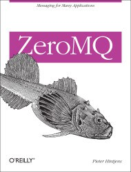

%YAML 1.1
---
title: "ØMQ: A dynamic book with surprises"
template: writing.j2
date: September 26, 2013
---

Last week I finished reading the [ZeroMQ
book](http://zguide.zeromq.org/page:all). I was expecting the usual drill:
talk about why `technology` is awesome, introduce API of `technology`, show
basic examples of `technology`, and show advanced examples of `technology`.

The ZeroMQ book *does* cover all the usual subjects, but it really impressed
because it went way beyond that standard expectation. I finished the book and
was very satisfied for two reasons:

1. The ZeroMQ technology is truly awesome. It does amazing things.
2. The author, Peter Hintjens, describes advanced ways of thinking about
   software development.

I'm not joking about how cool ZeroMQ is. Essentially, ZeroMQ is a really slick
way to communicate over networks. The tool seamlessly manages internal message
queues so that users are given a simple socket-like API to send and receive
data. ZeroMQ also has bindings in tons of languages. In fact, the online book
let's you choose the language of the examples. My choice was Python. Learning
in the language of your choice is a really fascinating way to get introduced to
a tool. I didn't have to read examples in a language I'm less comfortable in
and that greatly increased the rate of my understanding.

Hintjens also discussed some atypical topics. One of those topics was code
generation. My view of code generation was simple: it's nasty. The author
showed how to use code generation in an elegant way, yet he was quick to point
out that much code generation is nasty stuff. But when applied carefully, code
generation can replicate very tricky parts of code flawlessly and accurately
describe what you're trying to model. He gave an excellent example of creating
a functional state machine from a simple XML state model. The XML was cranked
through a code generator called [GSL](https://github.com/imatix/gsl), and a
beautiful source file came out on the other side. I was very impressed since
I'm used to seeing complete garbagefrom average code generators.

The other surprising development topic that was covered was protocols. This
topic makes a lot of sense for a networking tool, but I did not expect the
depth of coverage. Hintjens gives an overview of Augmented Backus-Naur Form
([ABNF](http://www.ietf.org/rfc/rfc2234.txt)) as a way to describe protocols.
He explains the rationale for using ABNF and the scenarios to use it. This
would be extremely dry, yet he does it with humor by using lolcats terminology
to detail his protocols (e.g., commands such as OHAI, SRSLY, and KTHXBAI).
It's an odd way to learn formal protocol specifications, but it worked for me.

When I finished this book, I had many interesting things to think about. I
still don't know the best times to use all these techniques, but seeing very
robust solutions to complicated problems grew my design thinking. My hope is
that I'll be able to use some of these patterns to write better code in the
future. ZeroMQ was a good book for learning about a neat technology, but it
may be even more valuable for shaping how developers can approach problems.
