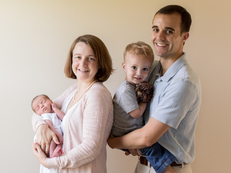

%YAML 1.1
---
title: Matt Layman
template: base.j2
---

I'm Matt,
a software creator.
I have a few
[organize Python Frederick](#frederick),
[open source projects](#projects),
[work at a startup](#work),
[love my family](#family),
and [go to church](#church).

I like to write on technology topics
with a focus on Python.
You can check out
my [writings](https://www.mattlayman.com/archive.html)
if you're inclined.

<a class="icon" href="https://twitter.com/mblayman"
   alt="Twitter"><i class="fa fa-twitter fa-2x"></i></a>
<a class="icon" href="https://github.com/mblayman"
   alt="GitHub"><i class="fa fa-github fa-2x"></i></a>
<a class="icon" href="https://www.linkedin.com/in/mattlayman"
   alt="LinkedIn"><i class="fa fa-linkedin fa-2x"></i></a>
<a class="icon" href="https://careers.stackoverflow.com/mattlayman"
   alt="Stack Overflow Careers"><i class="fa fa-stack-overflow fa-2x"></i></a>

## Frederick Technology

Frederick is a lovely small city
to the Northwest
of Washington, D.C.
When my family committed to staying
in Frederick,
I involved myself
in the technology scene
to find community
and foster a love of technology
among my fellow citizens.

* I started
  [Python Frederick](https://www.meetup.com/python-frederick/)
  in 2015
  and continue to organize it
  (with some fantastic co-organizers).
* I helped coordinate the city's first
  [Hackathon](http://www.hackfrederick.com/).
* Through my efforts
  on a team of tech volunteers,
  we earned Frederick a finalist spot
  in Amazon's [2017 City on a Cloud Innovation Challenge](https://aws.amazon.com/stateandlocal/cityonacloud/2017finalists/).

I care deeply about the place I now call home,
and I push hard to make sure
that its citizens have the opportunity to learn
about technology.

## Open Source

I enjoy spending time
on many open source projects.
Some are my own.
Some are the work of many.
All are fun.

### Django REST Framework JSON API

In 2017,
I picked up the torch
as the maintainer
of the [Django REST Framework JSON API](https://github.com/django-json-api/django-rest-framework-json-api)
package.
This package translates
Django REST Framework API output
into the [JSON API](http://jsonapi.org/) format.
I use this project
for [College Conductor](https://www.collegeconductor.com/)
to seamlessly communicate
with my [Ember](https://emberjs.com/) frontend.

### handroll

[handroll](http://handroll.github.io) is a tool to help build websites
similar to this one. When there is a limited range of material and a simple
design, handroll generates a website easily. [Check it out on
GitHub.](https://github.com/handroll/handroll)

### tappy

Automated software testing is generally useful,
and the [Test Anything Protocol (TAP)](http://testanything.org/)
is a way to track those automated results.
I wrote
[a set of TAP generators for Python](https://github.com/python-tap)
that hook in with Python's testing ecosystem.
The core project is called `tappy`.

## Work

I work at [Storybird](https://storybird.com). Storybird makes it possible for
people to share creative stories through book and poetry writing. I am a
software engineer with the opportunity to make Storybird an even better place
to share stories. I get to write Python every day and help make the Internet
more awesome.

[Lockheed Martin](http://lockheedmartin.com/) was my employer. While there, I
worked on a wide range of products. You might have heard of some of them, like
[GPS](http://en.wikipedia.org/wiki/Global_Positioning_System#Control_segment)
or [satellite phones](http://www.iridium.com/about/iridiumnext.aspx). I also
gained experience with Modeling and Simulation software, web applications, and
complex configuration management implementations.

## Family

I am a family man. I consider myself blessed to have a loving wife, Elease, and
two great kids, Mark and Faye. My children are very young so my life is a
little hectic, but that's perfectly fine with me.

## Church

I am a Christian, and I attend [New Hope OPC](http://newhopeopc.org/). My hope
is that my faith reflects on all of my behavior, and that I show kindness,
humility, and love.
